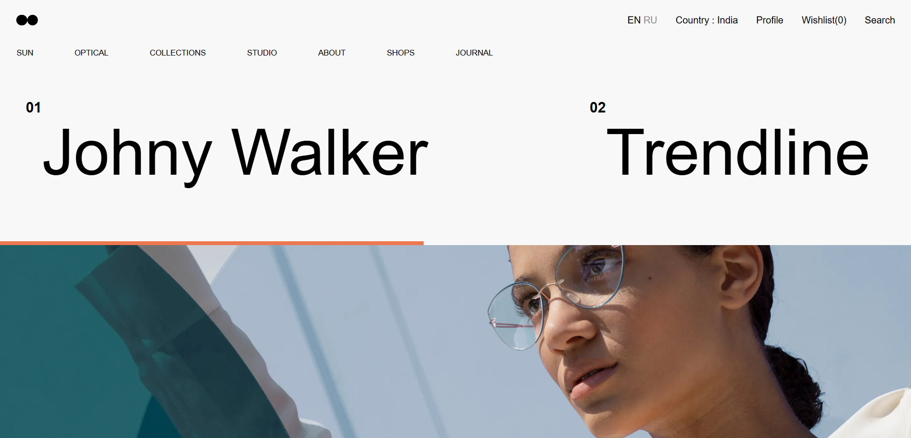

# Eyewear Showcase

Interactive web showcase for eyewear with a navigation bar, scrolling text, and an image gallery. Responsive design.

## Screenshot

*Note: Replace `screenshot.png` with the actual path to your screenshot.*

## Technologies

HTML, CSS, JavaScript (Font Awesome)

## Setup

1. Save `index.html` and `style.css` in the same directory.
2. Open `index.html` in your browser.

## Structure

* `index.html`: HTML content.
* `style.css`: CSS styles.

## Customization

Edit text, image URLs, and CSS in the respective files.

## Mobile

Responsive layout for smaller screens.

## Next Steps

* Add text scroll interactivity.
* Enhance image gallery.
* Implement mobile menu functionality.
* Add navigation links.